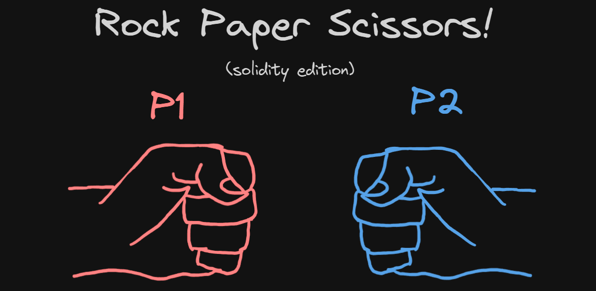
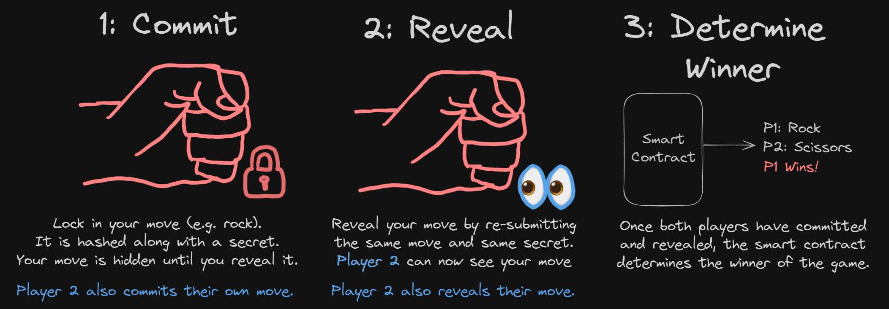
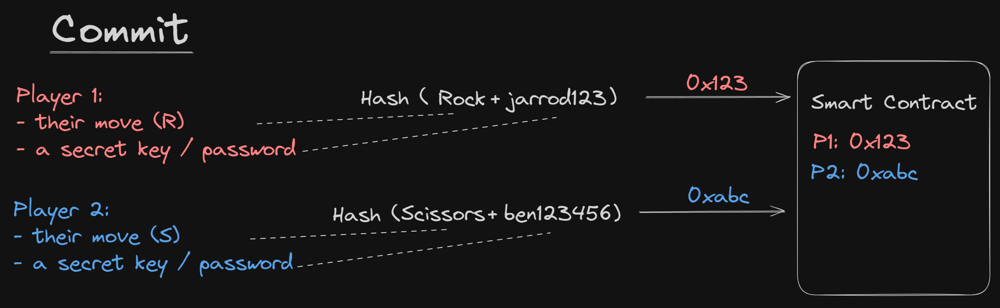
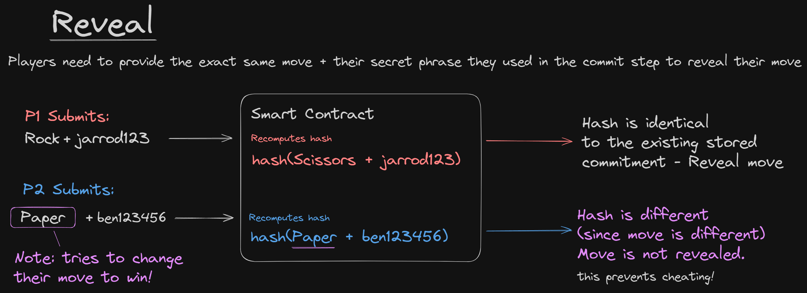
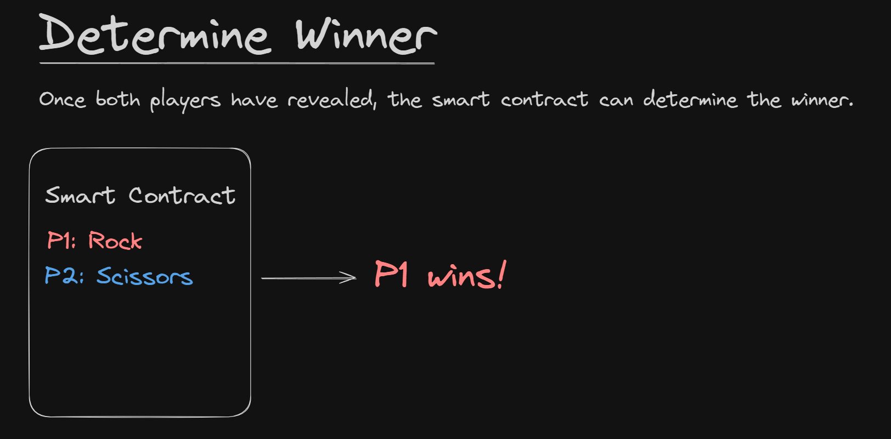

<p align="center">
  
</p>

<h1 align="center">
  Rock Paper Scissors in Solidity
</h1>

<p align="center">
  Build a simple Rock Paper Scissors smart contract using Solidity.
</p>

<p align="center">
  Use the commit-reveal scheme to prevent cheating!
</p>


## Get Started

This repo uses [Foundry](https://github.com/foundry-rs/foundry) as the development environment. To get started locally:

1. [Clone](https://docs.github.com/en/repositories/creating-and-managing-repositories/cloning-a-repository) the repository.

2. [Install Foundry](https://book.getfoundry.sh/getting-started/installation):

    ```bash
    curl -L https://foundry.paradigm.xyz | bash
    ```

3. Install the dependencies:

    ```bash
    foundry install
    ```

4. Build and test the smart contracts:
    
    ```bash
    foundry test
    ```

## How It Works

The `RockPaperScissors` smart contract allows two players to play a single game of rock-paper-scissors.

It uses the commit-reveal scheme to prevent cheating. We can break the game down into three steps:

1. **Commit**: Players commit to their move (either rock, paper, or scissors) by hashing their move along with a secret phrase together. The hash is submitted to the smart contract.

2. **Reveal**: Players reveal their move by providing the same move and secret phrase used in the commit step. The smart contract recomputes the hash and compares it with the hash submitted in the commit step. If the hashes are the same, the move is revealed.

3. **Determine Winner**: Once both players have revealed their moves, the smart contract determines the winner. The winner is determined by the rules of rock-paper-scissors:

    - Rock beats scissors
    - Scissors beats paper
    - Paper beats rock



### 1. Commit



The `commitMove` function accepts a `bytes32 _commitment` that is the hash of the player's move and secret phrase together and stores it in state.

For example, if a player wants to commit to the move "scissors" with the secret phrase "player1-secret":

```solidity
// Generate the hash: keccak256(move, secret)
bytes32 testCommitment = keccak256(
    abi.encodePacked(
        RockPaperScissors.MoveOption.Scissors,
        bytes32("player1-secret")
    )
);

// Commit the hash to the smart contract (locking in your move)
rps.commitMove(testCommitment);
```

The smart contract stores inside of a `gameMoves` mapping like so:

```solidity
gameMoves[msg.sender] = GameMove({
    commitment: _commitment,
    revealedMove: MoveOption.NotRevealedYet
});
```

Note that the `revealedMove` is set to `NotRevealedYet`, as the move must be hidden to avoid the other player from cheating.

### 2. Reveal



Once both players have committed, each player must reveal their move using the `revealMove` function. This function accepts two arguments:
1. `MoveOption _move`
2. `bytes32 _secret`

This function re-computes the hash by hashing the move and secret phrase provided together, and compares it with the original hash submitted in the commit step.

```solidity
bytes32 calculatedCommmitment = keccak256(
    abi.encodePacked(_move, _secret)
);
```

If the hashes match, this means both the **move** and the **secret** are the exact same as the ones the player originally committed. The move is then revealed, and the `revealedMove` field is updated in the `gameMoves` mapping.

```solidity
require(
    calculatedCommmitment == gameMoves[msg.sender].commitment,
    "Wrong move or wrong pasword"
);

gameMoves[msg.sender].revealedMove = _move;
```

### 3. Determine Winner



Determine winner is a simple function that follows the real rules of the game, i.e. rock beats scissors, scissors beats paper, and paper beats rock.

If the match results in a draw, it returns `address(0)`. Otherwise, it returns the address of the winner.


## Questions?

If you have any questions, feel free to open an issue or reach out to me on [Twitter](https://twitter.com/jarrodwattsdev).